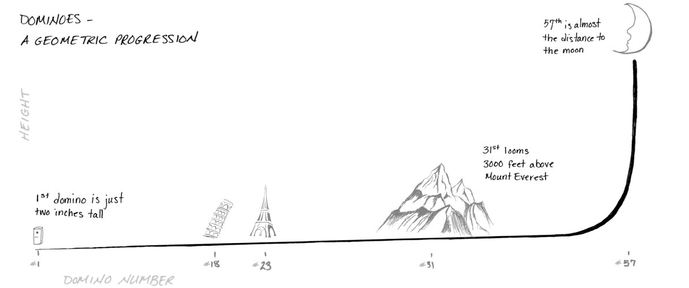
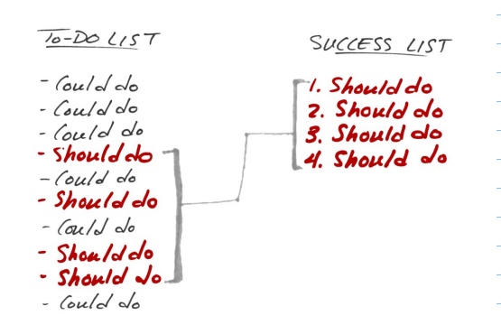
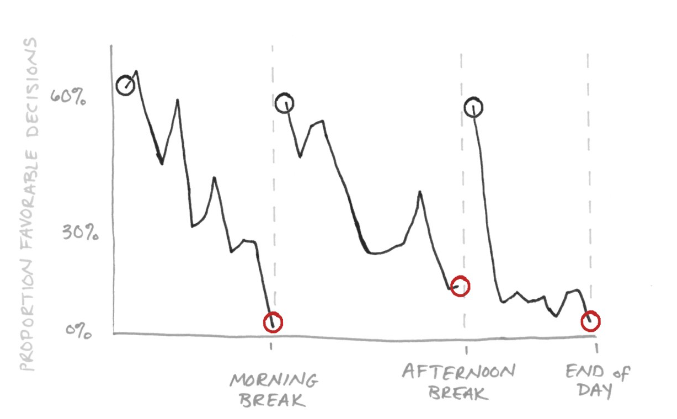
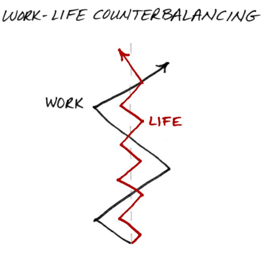
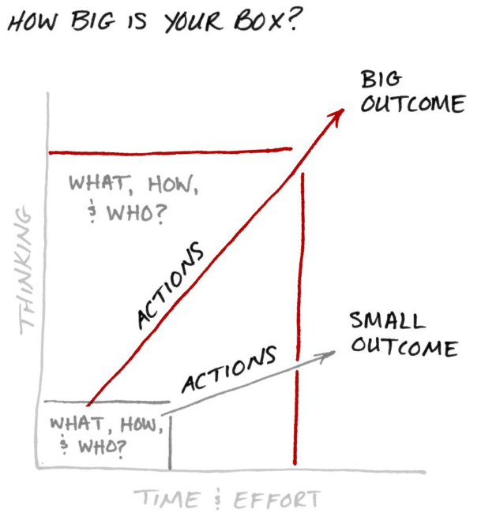

# NonCSBooksNotes
Personal notes for books that are not related to computer science

- [x] - [Cal Newport - Deep Work](#deep-work)
- [x] - [Edward B. Burger, Michael Starbird - The 5 Elements of Effective Thinking](#five-elements)
- [x] - [Mark Forster - Do It Tomorrow and Other Secrets of Time Management](#do-it-tomorrow)
- [ ] - [Gary Keller, Jay Papasan - The ONE Thing](#the-one-thing)
- [ ] - [Algorithms to Live By: The Computer Science of Human Decisions](#algorithms-to-live-by)
- [ ] - [Brain Rules - by John Medina](#brain-rules)
- [ ] - [Why We Sleep Matthew Walker](#)
---

### Deep Work (Cal Newport)<a name="deep-work"></a>
Rules for Focused Success in a Distracted World

```
Deep Work: Professional activities performed in a state of distraction-free concentration 
	       that push your cognitive capabilities to their limit. These efforts create new 
           value, improve your skill, and are hard to replicate.

Shallow Work: Noncognitively demanding, logistical-style tasks, often performed while 
              distracted. These efforts tend to not create much new value in the 
			  world and are easy to replicate

Spend enough time in a state of frenetic shallowness and you permanently reduce your 
capacity to perform deep work.

The ability to perform deep work is becoming increasingly rare at exactly the same time 
it is becoming increasingly valuable in our economy. As a consequence, the few who cultivate 
this skill, and then make it the core of their working life, will thrive.

In this new economy, three groups will have a particular advantage: those who can work well 
and creatively with intelligent machines, those who are the best at what they do, and 
those with access to capital.

Two Core Abilities for Thriving in the New Economy:
1. The ability to quickly master hard things.
2. The ability to produce at an elite level, in terms of both quality and speed.

Deliberate practice requires:
(1) your attention is focused tightly on a specific skill you’re trying to 
    improve or an idea you’re trying to master
(2) you receive feedback so you can correct your approach to keep your 
    attention exactly where it’s most productive


High-Quality Work Produced = (Time Spent) x (Intensity of Focus)

By maximizing your intensity when you work, you maximize the results you produce per unit of time 
spent working.

When you switch from some Task A to another Task B, your attention doesn’t immediately follow—a 
residue of your attention remains stuck thinking about the original task. This residue gets 
especially thick if your work on Task A was unbounded and of low intensity before you switched, 
but even if you finish Task A before moving on, your attention remains divided for a while.


If you’re not comfortable going deep for extended periods of time, it’ll be difficult 
to get your performanceto the peak levels of quality and quantity increasingly 
necessary to thrive professionally.


If you are just getting into some work and a phone goes off in the background, it ruins what 
you are concentrating on, even though you are not aware at the time, the brain 
responds to distractions.


Rules:
-> Work deeply
    + either work concentrated and uninterupted or dont work
    + rest from deep work, give your brain time to process stuff
    + before starting an deep work session ask yourself:
        -Where you'll work and how long?
        -How you'll work once you start
            >Will you use internet? 
            >How much pages will you write per hour?
        -How you'll support your work?
            >ensure you have water near you
            >have access to enough food
    + by leveragin a radical change to your normal enviroment coupeled perhaps with a significent 
      investment of efford 
      or money all dedicated towards supoprting a deep work task you increase the percieved 
      importance of the work
    + Be lazy: Idleness is not just a vacation, an indulgence or a vice; it is as indispensable 
      to the brain as vitamin D is to the body, and deprived of it we suffer a mental affliction 
      as disfiguring as rickets… it is, paradoxically, necessary to getting any work done

-> Embrace Boredom
    + To succeed with deep work you must rewire your brain to be comfortable resisting distracting 
      stimuli. This doesn’t mean that you have to eliminate distracting behaviors; it’s sufficient 
      that you instead eliminate the ability of such behaviors to hijack your attention
    + Meditate productively
        - The goal of productive meditation is to take a period in which you’re occupied physically but 
          not mentally—walking, jogging, driving, showering—and focus your attention on a single 
          well-defined professional problem

-> Quit Social Media
    + You’re justified in using a network tool if you can identify any possible benefit to its use, 
      or anything you might possibly miss out on if you don’t use it.
    + Identify the core factors that determine success and happiness in your professional and personal 
      life then adopt a tool only if positive impacts on these substantially outweight its negative 
      impacts
    + Ask yourself:
        - 1. Would the last thirty days have been notably better if I had been able to use this service?
        - 2. Did people care that I wasn’t using this service?
            > If your answer is “no” to both questions, quit the service permanently. If your answer 
              was a clear “yes,” then return to using the service. If your answers are qualified or 
              ambiguous,it’s up to you whether you return to the service

-> Drain the Shallows
    + Firstly understand that Deep work is exhausting because it pushes you toward the limit of your 
      abilities
    + "For someone new to such practice (citing, in particular, a child in the early stages 
       of developing an expert-level skill), an hour a day is a reasonable limit"
    + Decide in advance what you’re going to do with every minute of your workday
        - Advantage of scheduling your day is that you can determine how much time you’re 
          actually spending in shallow activities
    + Become hard to reach
        - Make people who send you email do more work
```
---

### The 5 Elements of Effective Thinking (Edward B. Burger, Michael Starbird)<a name="five-elements"></a>
```

Random quotes in book
> "Extraordinary people are just ordinary people who are thinking differently"
> "If you can’t solve a problem, then there is an easier problem you can’t solve: find it"
> "It’s not what you don’t know that gets you in trouble.
   It’s what you do know that ain’t so."
> "The way to get good ideas is to get lots of ideas and throw the bad ones away."
> "The unexamined life is not worth living"

==Understand deeply==
	> Don’t face complex issues head-on; first understand simple ideas deeply
	> Be brutally honest about what you know and don’t know
	> When you learn anything, go for depth and make it rock solid
	> Saying what you actually see forces you to become conscious of what is there and also what 
	  is missing. If you see it, then say it; if you don’t see it, then don’t claim to see it.
==Make mistakes==
	> Fail to succeed 
	> Mistakes are great teachers—they highlight unforeseen opportunities and holes in your 
      understanding
==Raise questions==
	> Constantly create questions to clarify and extend your understanding 
==Follow the flow of ideas==
	> Ideas are rare—milk them
	> Following the consequences of small ideas can result in big payoffs
==Change==
	> You can always improve, grow, and extract more out of your education, yourself, 
      and the way you live your life

----------------
|Seek essential|
----------------
If you literally clear the clutter from your desk, the remaining items are easy to find. 
But not only can clearing the clutter expose those things that you know are there; 
it can reveal the otherwise invisible essence of the situation

Example of asking good questions:
While stuck (and frustrated) in bumper-to-bumper traffic that is moving at a painfully slow crawl, you 
wonder (perhaps in more colorful language), “How can this traffic problem be fixed?!?” The answers are 
easy but not practical: increase the flow by widening the roads or constructing additional highways. But 
the reality is that unless you’re the president or governor, you cannot make either solution happen. Thus 
your frustration level rises along with your blood pressure. Your question was not a great one. Instead 
ask, “Given that I will spend an extra forty minutes in traffic, how can I use that time effectively?” 
Now you’re asking a question that is productive. You might consider books on tape to entertain or educate 
you, or language tapes to improve your Greek, or visits with distant family and friends via Bluetooth.

Ask meta questions
    > What’s the goal of this task?
    > What benefit flows from the task?

```
---

### Do It Tomorrow and Other Secrets of Time Management (Mark Forster)<a name="do-it-tomorrow"></a>
```
Random quotes from book
> "To complain about a shortage of time is like a fish in the sea complaining 
   that it has a shortage of water"
> "Just because something would be nice to eat, doesn’t mean you have to eat it"
> "Busy work often looks more like work than real work does"

The Principles:
    * Have a clear vision
    * One thing at a time
    * Little and often
        > human mind works most effectively when it is doing something little and often
    * Limits
    * Closed lists
        > don't add new stuff to your list.. close it and finish it before you add new tasks
    * Reduce randomness
        > We can never entirely get away from random elements in our day, but the more we 
          can eliminate them the more we will be able to control our day
    * Commitment vs interest

There are only 3 causes of time problem:
    > We are working inefficiently
    > We have too much to do
    > We have too little time to do it in

Real work vs Busy work
    Real work is what advances your business or your job
    Busy work, on the other hand, is what you do in order to avoid doing the real work

Detect wheather you are in busy work trap
> If you never have time to stop and think. Real work is thought expressing itself in action
> If your time horizon is always very short. Real work involves planning further ahead than
  the immediate horizon

Little and often

Schedule regular checks for your projects to ensure that 
they are developing in the way you want them to

``` 
---

### The ONE Thing (Gary Keller, Jay Papasan) <a name="the-one-thing"></a>
```
Extraordinary results are directly determined by how narrow you can make your focus
```

Remember "The domino effect"

```
Find the lead domino, and whack away at it until it falls
The key is over time. Success is built sequentially. It’s one thing at a time
```

#### The six lies between you and success

##### Everything Matters Equally



```
No matter how many to-dos you start with, you can always narrow it to one

1. Go small. Don't focus on being busy; focus on being productive. Allow what matters most to 
   drive your day.
2. Go extreme. Once you’ve figured out what actually matters, keep asking what matters most until 
   there is only one thing left. That core activity goes at the top of your success list.
3. Say no. Wheather you say "later" or "never" the point is to say “not now” to anything else you 
   could do until your most important work is done.

The most important thing is DOING the most important thing
```

##### Multitasking
```
"To do two things at once is to do neither."

You can do two things at once, but you can’t focus effectively on two things at once
```

##### A Disciplined Life
```
* Success is actually a short race—a sprint fueled by discipline just long enough for habit to 
  kick in and take over
* Success is about doing the right thing, not about doing everything right
* It takes an average of 66 days to acquire a new habit

tl;dr discipline+time=habbit
      habbit = success
```

##### Willpower Is Always on Will-Call
```
WHAT TAXES YOUR WILLPOWER
* Implementing new behaviors
* Filtering distractions
* Resisting temptation
* Suppressing emotion
* Restraining aggression
* Suppressing impulses
* Taking tests
* Trying to impress others
* Coping with fear
* Doing something you don’t enjoy
* Selecting long-term over short-term rewards
```
Your willpower during day


##### A Balanced Life
```
“Imagine life is a game in which you are juggling five balls. The balls are called work, family, 
health, friends, and integrity. And you’re keeping all of them in the air. But one day you finally
come to understand that work is a rubber ball. If you drop it, it will bounce back. The other four
balls family, health, friends, integrity—are made of glass. If you drop one of these, it will be
irrevocably scuffed, nicked, perhaps even shattered.”
```


##### Big is Bad
```
Don’t let small thinking cut your life down to size. Think big, aim high, act bold. And see just 
how big you can blow up your life.
```



---

### Algorithms to Live By: The Computer Science of Human Decisions (Brian Christian, Tom Griffiths)<a name="algorithms-to-live-by"></a>
```
Fill me with notes
```
---

### Brain Rules (John Medina)<a name="brain-rules"></a>
```
Fill me with notes
```
---

#### Random notes
```
On procrastination
> Reality check on what can go wrong in the future and keep opportunity cost in mind.
> Calculate the real risk objectively and set a plan for the worst case scenario
> Set the specific milestones and end goals
> Chunking the giant into digestible parts and serving yourself the first tiny bite
> Get out of the zombie state asap by refueling yourself as quickly and as effectively as 
  possible. --Sleep deprivation, ++water, ++good food
> Deadline spiced up with some juicy stake
  "I'll finish this book soon cause i need to learn X" - NO,
  "I'll finish this book in 6 days cause X must be learned to complete this stage" - better 
> Take the first tiny step asap and instead of last minute adrenaline, get high on dopamine
  by achieving micro-successes along the way
```


